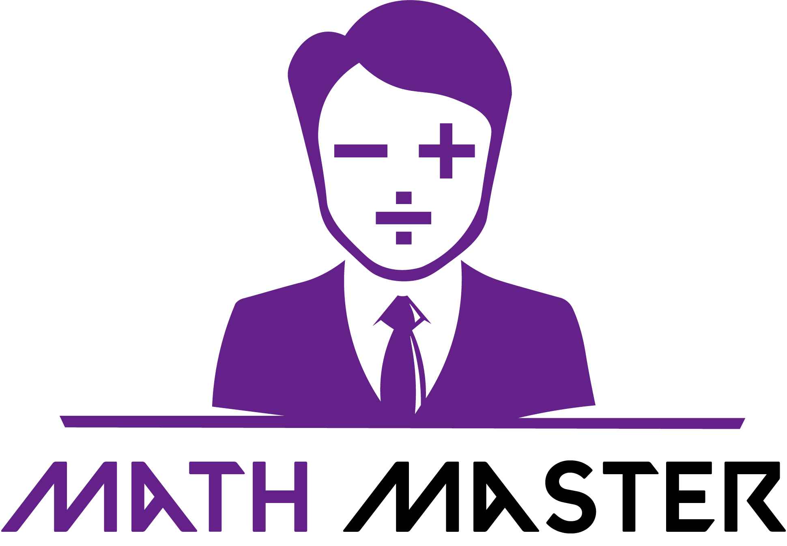
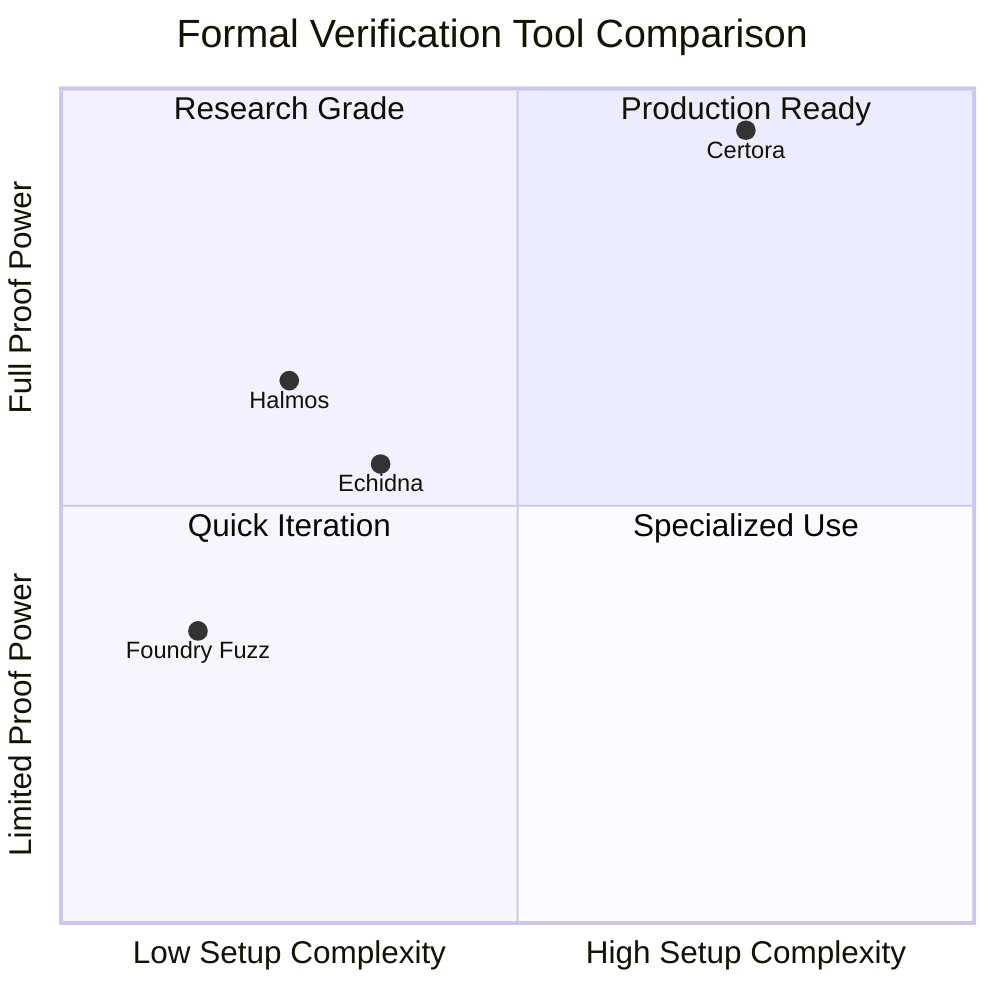
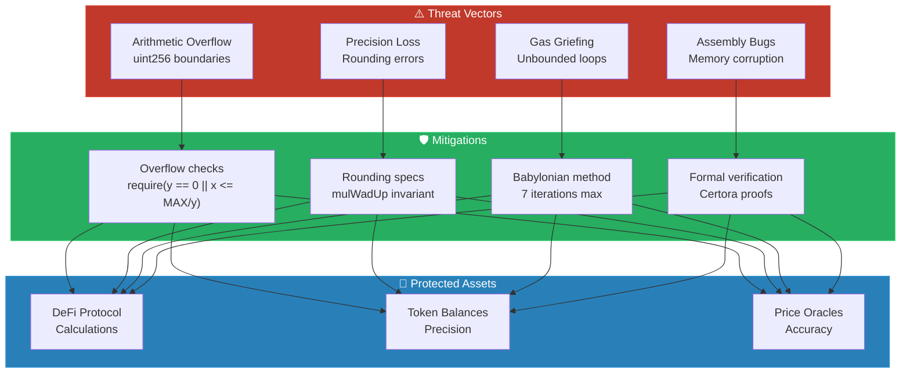

<p align="center"><p align="center">



<br/><br/>


# Formal Verification & Symbolic Execution# Math Master


**Mathematically proving smart contract correctness using Halmos & Certora***This codebase was inspired by the [solady](https://github.com/Vectorized/solady), [obront.eth](https://twitter.com/zachobront), and [solmate](https://github.com/transmissions11/solmate) codebases. Huge thanks to [karma](https://twitter.com/0xkarmacoma) for the help on FV with Halmos.*


[](https://soliditylang.org/)- [Math Master](#math-master)

[](https://getfoundry.sh/)- [About](#about)

[](https://www.certora.com/)- [Getting Started](#getting-started)

[](https://github.com/a16z/halmos)  - [Requirements](#requirements)

  - [Quickstart](#quickstart)

</p>- [Usage](#usage)

  - [Testing](#testing)

---    - [Test Coverage](#test-coverage)

- [Audit Scope Details](#audit-scope-details)

## Overview  - [Compatibilities](#compatibilities)

- [Roles](#roles)

This repository demonstrates **formal verification** and **symbolic execution** techniques applied to critical fixed-point arithmetic functions. The target: a `MathMasters` library implementing `mulWad`, `mulWadUp`, and `sqrt` operations—core primitives used across DeFi protocols.- [Known Issues](#known-issues)


**Key Outcomes:**# About

- ✅ Identified **3 critical bugs** in assembly-optimized math functions

- ✅ Proved mathematical invariants across **2²⁵⁶ input space**# Getting Started

- ✅ Compared verification tools: Halmos (symbolic) vs Certora (SMT-based)

## Requirements

---

- [git](https://git-scm.com/book/en/v2/Getting-Started-Installing-Git)

## Table of Contents  - You'll know you did it right if you can run `git --version` and you see a response like `git version x.x.x`

- [foundry](https://getfoundry.sh/)

- [Architecture](#architecture)  - You'll know you did it right if you can run `forge --version` and you see a response like `forge 0.2.0 (816e00b 2023-03-16T00:05:26.396218Z)`

- [Verification Methodology](#verification-methodology)- [python3 & pip3](https://www.python.org/downloads/)

- [Bugs Discovered](#bugs-discovered)  - You'll know you did it right if you can run `python3 --version` and you see a response like `Python 3.x.x`

- [ADR: Tool Selection Trade-offs](#adr-tool-selection-trade-offs)  - [Halmos](https://github.com/a16z/halmos)

- [Threat Model](#threat-model)    - To know you've installed it run `halmos --version` and you should see something like `halmos 0.1.0 (816e00b 2023-03-16T00:05:26.396218Z)

- [Quick Start](#quick-start)  - [certoraRun](https://docs.certora.com/en/latest/docs/user-guide/getting-started/install.html)

- [Verification Specs](#verification-specs)    - You'll know you did it right if you can run `certoraRun --version` and you get an output like: `certora-cli 6.3.1`

- [Tech Stack](#tech-stack)

*Note: I like to install `certoraRun` and `halmos` using [pipx](https://github.com/pypa/pipx) instead of `pip`.*

---

## Quickstart

## Architecture

```

```mermaidgit clone https://github.com/Cyfrin/2-math-master-audit

flowchart TBcd 2-math-master-audit

    subgraph Target["🎯 Target Contract"]make

        MM[MathMasters.sol]```

        MW[mulWad]

        MWU[mulWadUp]# Usage

        SQRT[sqrt]

        MM --> MW & MWU & SQRT## Testing

    end

```

    subgraph FV["🔬 Formal Verification Layer"]forge test

        direction TB```

        HALMOS[Halmos<br/>Symbolic Executor]

        CERTORA[Certora Prover<br/>SMT Solver]### Test Coverage

        FUZZ[Foundry Fuzz<br/>Property Testing]

    end```

forge coverage

    subgraph SPECS["📋 Specifications"]```

        MWS[mulWadUp.spec<br/>Rounding Invariants]

        SS[sqrt.spec<br/>Babylonian Correctness]and for coverage based testing:

        FT[Fuzz Tests<br/>check_* functions]

    end```

forge coverage --report debug

    subgraph REF["📚 Reference Implementations"]```

        SOLMATE[Solmate sqrt]

        UNI[Uniswap sqrt]# Audit Scope Details

    end

- Commit Hash: 

    MM --> HALMOS & CERTORA & FUZZ```

    MWS & SS --> CERTORAc7643faa1a188a51b2167b68250816f90a9668c6

    FT --> HALMOS```

    REF --> CERTORA & FUZZ

- In Scope:

    style Target fill:#1a1a2e,stroke:#00d4aa,color:#fff```

    style FV fill:#16213e,stroke:#e94560,color:#fff#-- MathMasters.sol

    style SPECS fill:#0f3460,stroke:#ffd700,color:#fff```

    style REF fill:#1a1a2e,stroke:#7b2cbf,color:#fff

```## Compatibilities


---- Solc Version: xx

- Chain(s) to deploy contract to: 

## Verification Methodology  - Ethereum

- Tokens:

```mermaid  - None

flowchart LR

    subgraph Phase1["Phase 1: Static Analysis"]# Roles

        A1[Slither] --> A2[Aderyn]

        A2 --> A3["Issue Triage"]XX

    end

# Known Issues

    subgraph Phase2["Phase 2: Fuzz Testing"]

        B1["Property-Based<br/>Fuzz Tests"] --> B2["Stateless Fuzzing<br/>10K+ runs"]None

        B2 --> B3["Counterexample<br/>Analysis"]
    end

    subgraph Phase3["Phase 3: Symbolic Execution"]
        C1["Halmos<br/>check_* functions"] --> C2["Path Exploration<br/>All branches"]
        C2 --> C3["SMT Constraint<br/>Solving"]
    end

    subgraph Phase4["Phase 4: Formal Proofs"]
        D1["Certora Specs<br/>CVL Rules"] --> D2["Invariant<br/>Verification"]
        D2 --> D3["Mathematical<br/>Proof"]
    end

    Phase1 --> Phase2 --> Phase3 --> Phase4

    style Phase1 fill:#2d3436,stroke:#00cec9,color:#fff
    style Phase2 fill:#2d3436,stroke:#fdcb6e,color:#fff
    style Phase3 fill:#2d3436,stroke:#e17055,color:#fff
    style Phase4 fill:#2d3436,stroke:#6c5ce7,color:#fff
```

### Verification Techniques Applied

| Technique | Tool | Coverage | Purpose |
|-----------|------|----------|---------|
| Static Analysis | Slither, Aderyn | Code patterns | Detect common vulnerabilities |
| Property Fuzzing | Foundry | ~10K inputs | Find edge cases |
| Symbolic Execution | Halmos | All paths | Exhaustive path coverage |
| Formal Verification | Certora | Mathematical | Prove invariants hold ∀ inputs |

---

## Bugs Discovered

### 🔴 Critical: Incorrect Error Selector in `mulWad`/`mulWadUp`

```solidity
// ❌ Bug: Wrong selector stored
mstore(0x40, 0xbac65e5b)  // Incorrect

// ✅ Correct selector for MathMasters__MulWadFailed()
mstore(0x00, 0xa56044f7)
```

**Impact:** Silent failures, incorrect error handling in integrating contracts.

---

### 🔴 Critical: Empty Revert Data

```solidity
// ❌ Bug: Reverts from 0x1c (empty memory region)
revert(0x1c, 0x04)

// Error placed at 0x5c but revert reads from 0x1c
// Result: Empty revert with no error message
```

**Impact:** Debugging impossible; integrators cannot catch specific errors.

---

### 🟠 High: Incorrect Constant in `sqrt` Initial Estimate

```solidity
// ❌ Bug in sqrt function
r := or(r, shl(4, lt(16777002, shr(r, x))))  // Wrong: 16777002

// ✅ Correct constant
r := or(r, shl(4, lt(16777215, shr(r, x))))  // Correct: 0xffffff
```

**Impact:** Incorrect square root for specific input ranges. Discovered via differential testing against Solmate/Uniswap implementations.

**Failing Input:**
```
x = 0xfffffeffffffffffffffffffffffffffffffffffffffff
```

---

## ADR: Tool Selection Trade-offs

### Decision Record: Halmos vs Certora



| Criteria | Halmos | Certora |
|----------|--------|---------|
| **Setup** | Native Foundry integration | Requires CVL specs + config |
| **Speed** | Fast iteration | Slower, cloud-based |
| **Proof Strength** | Bounded symbolic | Full SMT proofs |
| **Learning Curve** | Low (Solidity tests) | Medium (CVL language) |
| **Cost** | Free/Open Source | Commercial license |
| **Best For** | Development-time checks | Pre-deployment audits |

### Recommendation

**Use Both:**
- **Halmos** during development for quick symbolic checks
- **Certora** for pre-deployment formal proofs on critical invariants

---

## Threat Model



### Security Properties Verified

| Property | Specification | Status |
|----------|---------------|--------|
| **mulWadUp Rounding** | `result == (x*y == 0 ? 0 : (x*y-1)/WAD + 1)` | ✅ Proved |
| **sqrt Correctness** | `sqrt(x) == solmateSqrt(x)` for valid range | ✅ Proved |
| **Overflow Protection** | No overflow when `y <= MAX/x` | ✅ Proved |

---

## Quick Start

### Prerequisites

```bash
# Foundry
curl -L https://foundry.paradigm.xyz | bash
foundryup

# Halmos (via pipx recommended)
pipx install halmos

# Certora (requires license key)
pipx install certora-cli
export CERTORAKEY=<your-key>
```

### Installation

```bash
git clone https://github.com/a1111198/Formal-verification-and-symbolic-Execution.git
cd Formal-verification-and-symbolic-Execution
forge install
```

### Run Verification Suite

```bash
# Unit + Fuzz Tests
forge test -vvv

# Halmos Symbolic Execution
halmos --function check_

# Certora Formal Verification
certoraRun certora/mulWadUp.conf
certoraRun certora/sqrt.conf

# Static Analysis
slither src/ --config-file slither.config.json
```

---

## Verification Specs

### Certora: mulWadUp Invariant

```cvl
// certora/mulWadUp.spec
definition WAD() returns uint256 = 1000000000000000000;

invariant check_testMulWadUp(uint256 x, uint256 y)
    mulWadUp(x, y) == assert_uint256(
        x * y == 0 ? 0 : (x * y - 1) / WAD() + 1
    )
    {
        preserved {
            require (x == 0 || y == 0 || y <= max_uint256 / x);
        }
    }
```

### Halmos: Symbolic Test

```solidity
// Halmos automatically explores all paths
function check_testMulWadUpFuzz(uint256 x, uint256 y) public pure {
    if (x == 0 || y == 0 || y <= type(uint256).max / x) {
        uint256 result = MathMasters.mulWadUp(x, y);
        uint256 expected = x * y == 0 ? 0 : (x * y - 1) / 1e18 + 1;
        assert(result == expected);
    }
}
```

---

## Tech Stack

| Category | Technologies |
|----------|-------------|
| **Smart Contracts** | Solidity ^0.8.3, Yul/Assembly |
| **Testing** | Foundry, Forge |
| **Symbolic Execution** | Halmos |
| **Formal Verification** | Certora Prover |
| **Static Analysis** | Slither, Aderyn |
| **Reference** | Solmate, Solady, Uniswap |

---

## Project Structure

```
├── src/
│   └── MathMasters.sol      # Target: Fixed-point math library
├── test/
│   ├── MathMasters.t.sol    # Fuzz tests + Halmos check_* functions
│   └── CompactCodeBase.sol  # Certora verification wrapper
├── certora/
│   ├── mulWadUp.spec        # CVL spec: rounding invariants
│   ├── mulWadUp.conf        # Certora config
│   ├── sqrt.spec            # CVL spec: sqrt correctness
│   └── sqrt.conf            # Certora config
└── report.md                # Aderyn static analysis output
```

---

## References

- [Solady FixedPointMathLib](https://github.com/Vectorized/solady) - Reference implementation
- [Solmate](https://github.com/transmissions11/solmate) - Gas-optimized contracts
- [Halmos Docs](https://github.com/a16z/halmos) - Symbolic testing
- [Certora Documentation](https://docs.certora.com) - Formal verification
- [Cyfrin Updraft](https://updraft.cyfrin.io) - Security course

---

## Author

**Akash Bansal** — Blockchain Security Engineer

[](https://linkedin.com/in/theakashbansal)
[](https://github.com/a1111198)
[](https://twitter.com/akbansal_)

---

<p align="center">
<i>Proving correctness, one invariant at a time.</i>
</p>
